# How to Easily Set Up a Full-Featured Mail Server on Ubuntu 22.04 with iRedMail

## Step 1: Choose the Right Hosting Provider and Buy a Domain Name
To set up a full-featured email server with iRedMail, you need a server with at least **4GB** RAM & **4 core** CPU, because after the installation, your server will use more than 2GB of RAM.

**It is highly recommended that you install iRedMail on a clean fresh Ubuntu 22.04 server. If you use an existing production server, iRedMail might wipe away your existing database.**


## Step 2: Creating DNS MX Record
The MX record specifies which host or hosts handle emails for a particular domain name. For example, the host that handles emails for milad.com is `mail.milad.com`. If someone with a Gmail account sends an email to [`[email protected]`](https://www.linuxbabe.com/cdn-cgi/l/email-protection), then Gmail server will query the MX record of milad.com. When it finds out that `mail.milad.com` is responsible for accepting email, it then query the A record of `mail.milad.com` to get the IP address, thus the email can be delivered.

In your DNS manager, create a MX record for your domain name. Enter `@` in the Name field to represent the main domain name, then enter `mail.your-domain.com` in the Value field.

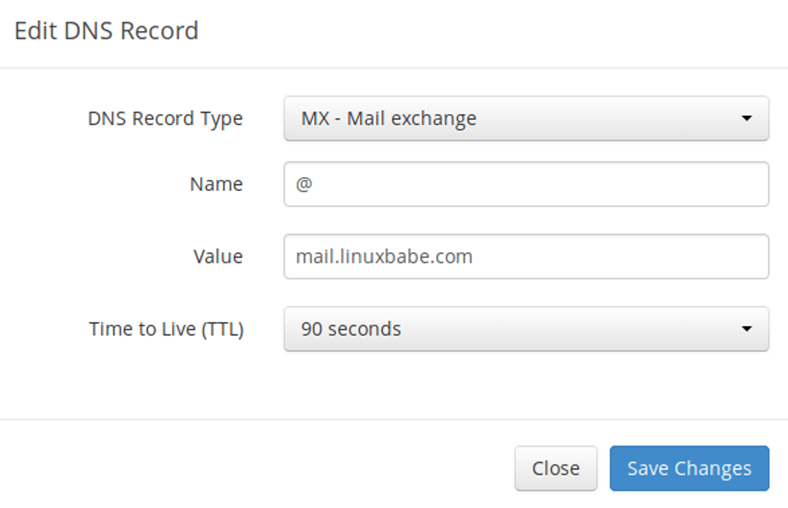 

**Note:** The hostname for MX record can not be an alias to another name. Also, It’s highly recommended that you use hostnames, rather than bare IP addresses for MX record.

Your DNS manager may require you to enter a preference value (aka priority value). It can be any number between 0 and 65,356. A small number has higher priority than a big number. It’s recommended that you set the value to 0, so this mail server will have the highest priority for receiving emails. After creating MX record, you also need to create an A record for `mail.your-domain.com` , so that it can be resolved to an IP address. If your server uses IPv6 address, be sure to add AAAA record.

A record : 

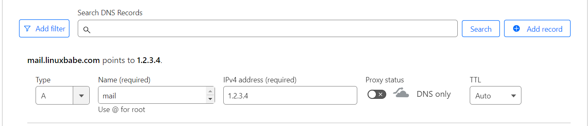 

Hint: If you use Cloudflare DNS service, you should not enable the CDN feature when creating A record for `mail.your-domain.com`. Cloudflare does not support SMTP proxy.

## Step 3: Configuring Hostname

Log into your server via SSH then run the following command to update existing software packages.
```
sudo apt update && apt upgrade && apt install -y gzip dialog
```
I strongly recommend creating a sudo user for managing your server rather than using the default root user. Run the following command to create a user. Replace username with your preferred username.

```
adduser username
```

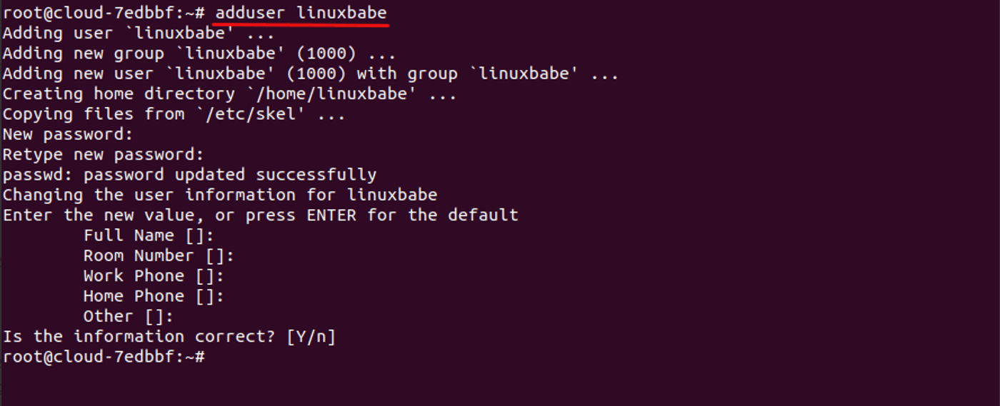 

Then add the user to the `sudo` group.

Then switch to the new user.
```
su - username
```

Next, set a fully qualified domain name (FQDN) for your server with the following command.

```
sudo hostnamectl set-hostname mail.your-domain.com
```
We also need to update /etc/hosts file with a command line text editor like Nano.
```
sudo nano /etc/hosts
```
Edit it like below. (Use arrow keys to move the cursor in the file.)
```
127.0.0.1       mail.your-domain.com mail localhost
```
Save and close the file. (To save a file in Nano text editor, press `Ctrl+O`, then press `Enter` to confirm. To close the file, press `Ctrl+X`.)

To see the changes, re-login and then run the following command to see your hostname.

```
hostname -f
```

## Step 4: Setting up Mail Server on Ubuntu 22.04 with iRedMail

Run the following commands to download the latest version of iRedMail script installer from its Github repository.

```
wget https://github.com/iredmail/iRedMail/archive/refs/tags/1.7.1.tar.gz
```
Extract the archived file.
```
tar xvf 1.7.1.tar.gz
```
Then cd into the newly-created directory.
```
cd iRedMail-1.7.1/
```
Add executable permission to the iRedMail.sh script. then run.
```
chmod +x iRedMail.sh
sudo bash iRedMail.sh
```
The mail server setup wizard will appear. Use the Tab key to select Yes and press Enter.

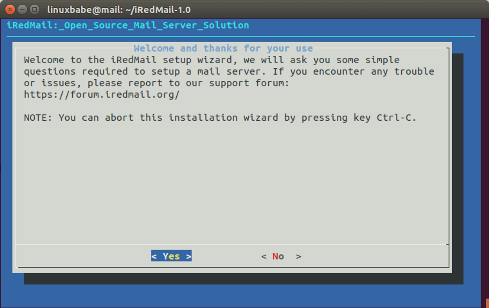 

The next screen will ask you to select the mail storage path. You can use the default one /var/vmail, so simply press Enter.  

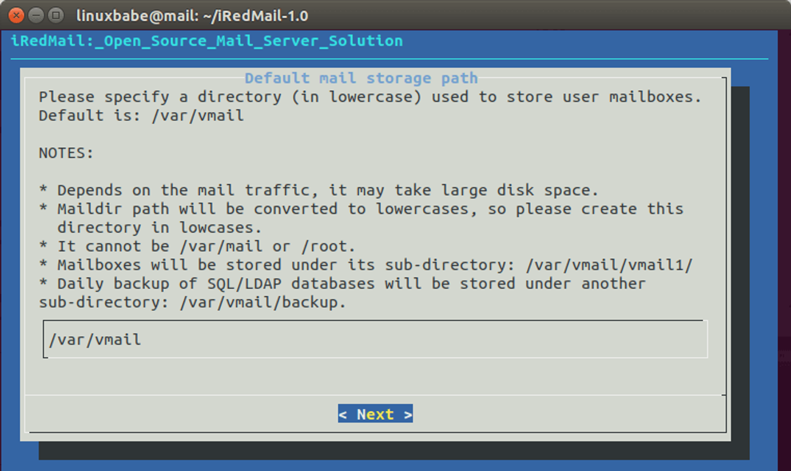 


Then choose whether you want to run a web server. It’s highly recommended that you choose to run a web server because you need the web-based admin panel to add email accounts. Also, it allows you to access the Roundcube webmail. By default, Nginx web server is selected, so you can simply press Enter. (An asterisk indicates the item is selected.)


 


Then select the storage backend for email accounts. Choose one that you are familiar with. This tutorial chose MariaDB. Press up and down arrow key and press the space bar to select.


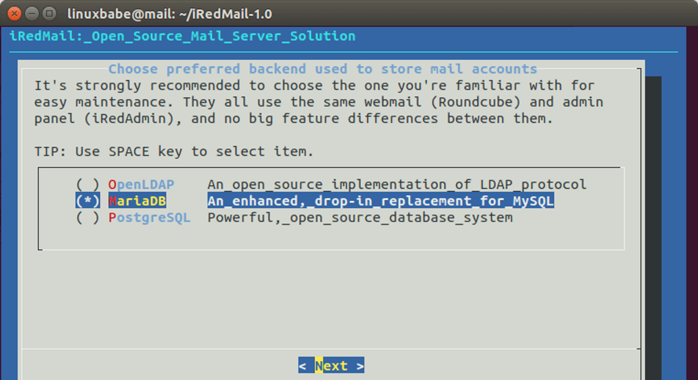   

If you selected MariaDB or MySQL, then you will need to set the MySQL root password.


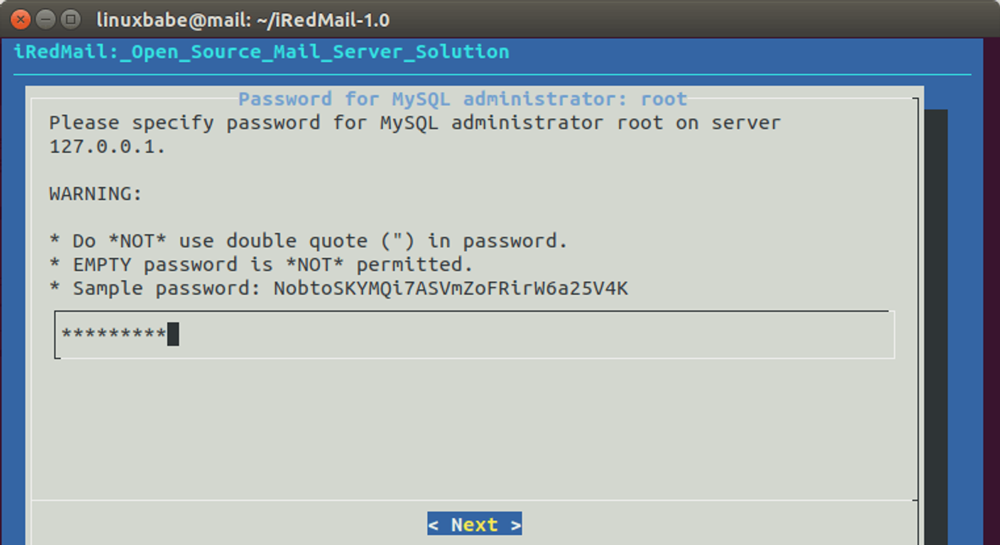   

Note that if you selected MariaDB, then you don’t need password to log into MariaDB shell. Instead of running the normal command mysql -u root -p, you can run the following command to login, with sudo and without providing MariaDB root password.

```
sudo mysql -u root
```

This is because the MariaDB package on Ubuntu 22.04 uses unix_socket authentication plugin, which allows users to use OS credentials to connect to MariaDB, but you still need to set root password in iRedMail setup wizard.

Next, enter your first mail domain. You can add additional mail domains later in the web-based admin panel. This tutorial assumes that you want an email account like. In that case, you need to enter **your-domain.com** here, without sub-domain. Do not press the space bar after your domain name. I think iRedMail will copy the space character along with your domain name, which can result in installation failure.

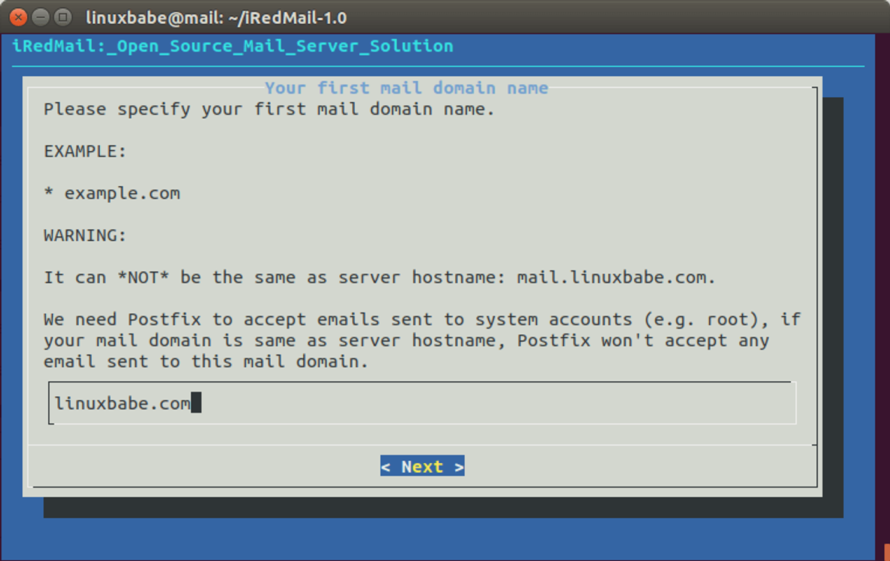   

Next, set a password for the mail domain administrator.  

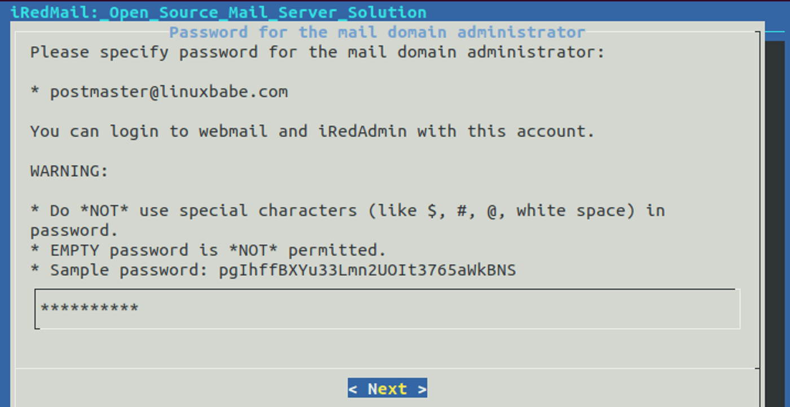   

Choose optional components. By default, 4 items are selected. Please note that SOGo groupware doesn’t support Ubuntu 22.04 right now, so don’t select it.

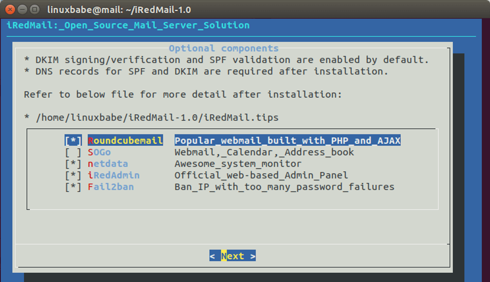  

Now you can review your configurations. Type Y to begin the installation of all mail server components.

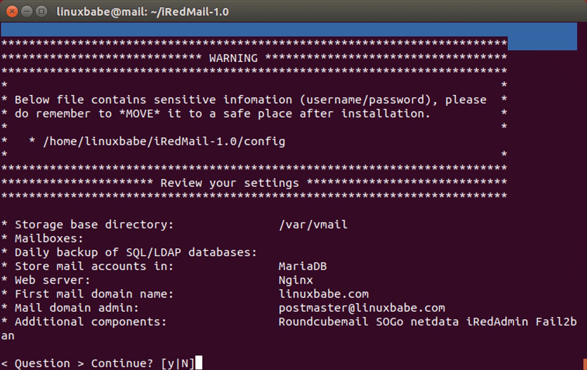  

it is depending on you to enable firewall rules provided by iRedMail , becuase of outside firewall like (security groups and ...) but its better to enable it 

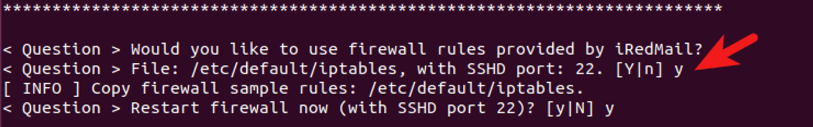  

Now iRedMail installation is complete. You will be notified the URL of webmail, SOGo groupware and web admin panel and the login credentials. The iRedMail.tips file contains important information about your iRedMail server.

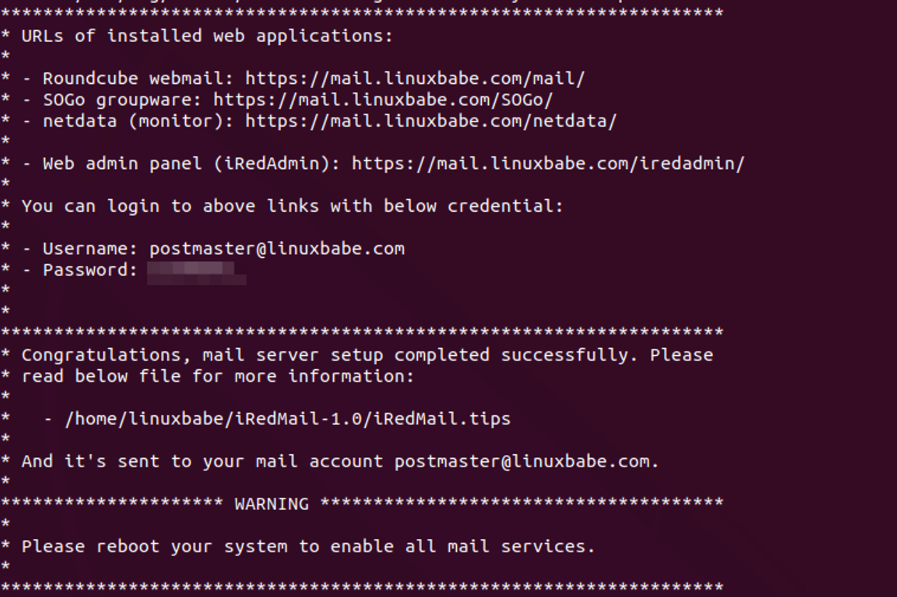  

Reboot your Ubuntu 22.04 server.

```
sudo reboot now
```

Once your server is back online, you can visit the web admin panel.

```
https://mail.your-domain.com/iredadmin/
```
*Note* that in the above URL, the sub-directory for accessing the admin panel is /iredadmin/, not /iredmail/. And because it’s using a self-signed TLS certificate, you need to add security exception in your web browser.


## Step 5: Installing Let’s Encrypt TLS Certificate 

Since the mail server is using a self-signed TLS certificate, both desktop mail client users and webmail client users will see a warning. To fix this, we can obtain and install a free Let’s Encrypt TLS certificate.

### Obtaining the Certificate  

First, log into your server again via SSH and run the following commands to install Let’s Encrypt (certbot) client on Ubuntu 22.04.

```
sudo apt install certbot python3-certbot-nginx -y
```

iRedMail has already configured TLS settings in the default Nginx virtual host, so here I recommend using the webroot plugin, instead of nginx plugin, to obtain certificate. Run the following command. Replace red text with your actual data.

```
sudo certbot certonly --webroot --agree-tos --email[email protected] -d mail.your-domain.com -w /var/www/html/
```
When it asks you if you want to receive communications from EFF, you can choose No.

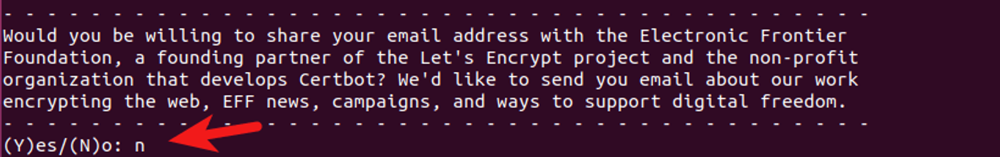

If everything went well, you will see the following text indicating that you have successfully obtained a TLS certificate. Your certificate and chain have been saved at /etc/letsencrypt/live/mail.your-domain.com/ directory.

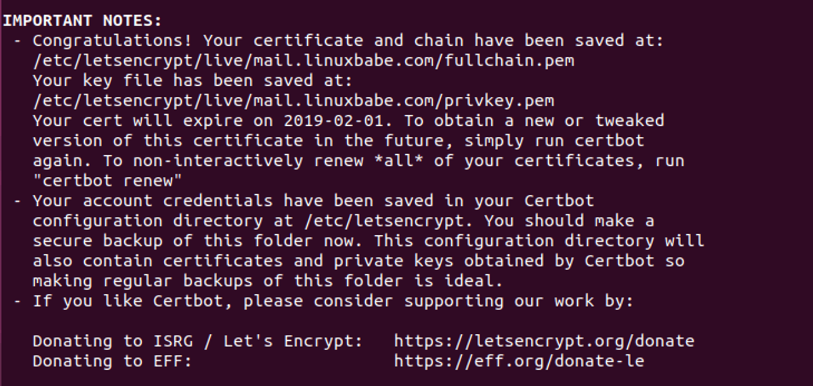

### Failure to Obtain TLS Certificate


If certbot failed to obtain TLS certificate, maybe it’s because your DNS records are not propagated to the Internet. Depending on the domain registrar you use, your DNS record might be propagated instantly, or it might take up to 24 hours to propagate. You can go to [https://dnsmap.io](https://dnsmap.io/), enter your mail server’s hostname (`mail.your-domain.com`) to check DNS propagation.

If certbot failed to obtain a certificate and you saw the following message,
```
Failed authorization procedure. mail.milad.com (http-01): urn:ietf:params:acme:error:connection :: The server could not connect to the client to verify the domain :: Fetching https://mail.milad.com/.well-known/acme-challenge/IZ7hMmRE4ZlGW7cXYoq2Lc_VrFzVFyfW6E0pzNlhiOA: Timeout during connect (likely firewall problem)
```

It might be that you have set AAAA record for mail.your-domain.com, but Nginx web server doesn’t listen on IPv6 address. To fix this error, edit the /etc/nginx/sites-enabled/00-default.conf file

```
sudo nano /etc/nginx/sites-enabled/00-default.conf
```
Find the following line.
```
#listen [::]:80;
```
Remove the # character to enable IPv6 for this Nginx virtual host.
```
listen [::]:80;
```

Save and close the file. Then edit the SSL virtual host `/etc/nginx/sites-enabled/00-default-ssl.conf`.

```
sudo nano /etc/nginx/sites-enabled/00-default-ssl.conf
```
Add the following line.
```
listen [::]:443 ssl http2;
```

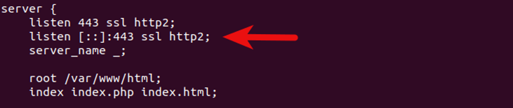

Save and close the file. Then test Nginx configuration.
```
sudo nginx -t
```
If the test is successful, reload Nginx for the change to take effect.

```
sudo systemctl reload nginx
```
Run the following command again to obtain TLS certificate. Replace red text with your actual data.
```
sudo certbot certonly --webroot --agree-tos --email[email protected] -d mail.your-domain.com -w /var/www/html/
```

Now you should be able to successfully obtain TLS certificate.

### Installing the Certificate in Nginx

After obtaining a TLS certificate, let’s configure Nginx web server to use it. Edit the SSL template file.

```
sudo nano /etc/nginx/templates/ssl.tmpl
```
Find the following 2 lines.
```
ssl_certificate /etc/ssl/certs/iRedMail.crt;
ssl_certificate_key /etc/ssl/private/iRedMail.key;
```
Replace them with:
```
ssl_certificate /etc/letsencrypt/live/mail.your-domain.com/fullchain.pem;
ssl_certificate_key /etc/letsencrypt/live/mail.your-domain.com/privkey.pem;
```

Save and close the file. Then test nginx configuration and reload.

```
sudo nginx -t

sudo systemctl reload nginx

```

Visit iRedMail admin panel again, your web browser won’t warn you any more because Nginx is now using a valid TLS certificate.

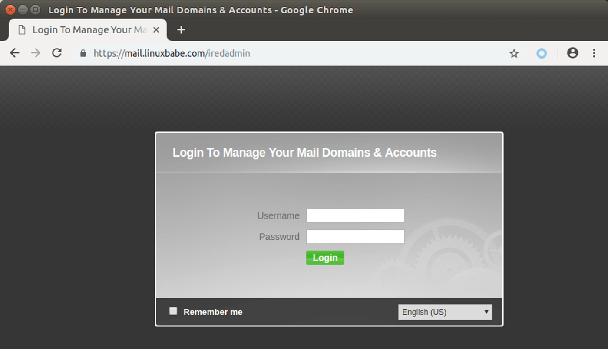

### Installing TLS Certificate in Postfix and Dovecot   

We also need to configure Postfix SMTP server and Dovecot IMAP server to use the Let’s Encrypt issued certificate so that desktop mail client won’t display security warning. Edit the main configuration file of Postfix.

```
sudo nano /etc/postfix/main.cf
```

Find the following 3 lines. (line 95, 96, 97).

```
smtpd_tls_key_file = /etc/ssl/private/iRedMail.key
smtpd_tls_cert_file = /etc/ssl/certs/iRedMail.crt
smtpd_tls_CAfile = /etc/ssl/certs/iRedMail.crt
```
Replace them with:

```
smtpd_tls_key_file = /etc/letsencrypt/live/mail.your-domain.com/privkey.pem
smtpd_tls_cert_file = /etc/letsencrypt/live/mail.your-domain.com/cert.pem
smtpd_tls_CAfile = /etc/letsencrypt/live/mail.your-domain.com/chain.pem
```
Save and close the file. Then reload Postfix.

```
sudo systemctl reload postfix
```

Next, edit the main configuration file of Dovecot.

```
sudo nano /etc/dovecot/dovecot.conf
```

Fine the following 2 lines. (line 47, 48)

```
ssl_cert = </etc/ssl/certs/iRedMail.crt
ssl_key = </etc/ssl/private/iRedMail.key
```

Replace them with:

```
ssl_cert = </etc/letsencrypt/live/mail.your-domain.com/fullchain.pem
ssl_key = </etc/letsencrypt/live/mail.your-domain.com/privkey.pem
```

Save and close the file. Then reload dovecot.

```
sudo systemctl reload dovecot
```
From now on, desktop mail users won’t see security warnings.

## Step 6: Sending Test Email

Log into iredadmin panel with the postmaster mail account ([email protected]). In the `Add` tab, you can add additional domains or email addresses.

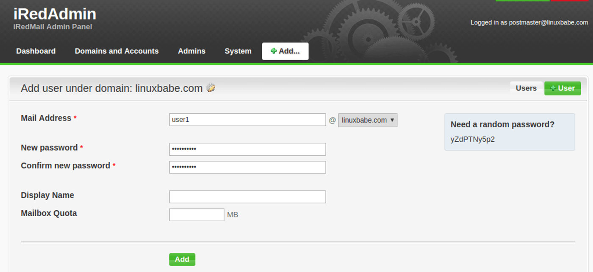

After you create a user, you can visit the Roundcube webmail address and login with the new mail user account.

```
https://mail.your-domain.com/mail/
```

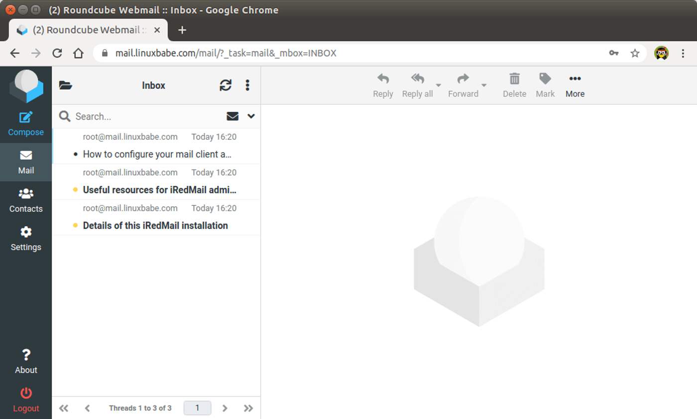

Now you can test email sending and receiving. Please note that you may need to wait a few minutes to receive emails because iRedMail by default enables greylisting, which is a way to tell other sending SMTP servers to try again in a few minutes. The following line in mail log file `/var/log/mail.log` indicates greylisting is enabled.

```
Recipient address rejected: Intentional policy rejection, please try again later;
```
### Adding Swap Space

ClamAV is used to scan viruses in email messages. ClamAV can use a fair amount of RAM. If there’s not enough RAM on your server, ClamAV won’t work properly, which will prevent your mail server from sending emails. You can add a swap file to your server to increase the total RAM on your server. (Note that using swap space on the server will degrade server performance. If you want better performance, you should upgrade the physical RAM instead of using swap space.)

To add swap space on the server, first, use the `fallocate` command to create a file. For example, create a file named swapfile with 1G capacity in root file system:


```
sudo fallocate -l 1G /swapfile
```

Then make sure only root can read and write to it.

```
sudo chmod 600 /swapfile
```

Format it to swap:
```
sudo mkswap /swapfile
```

Output:
```
Setting up swapspace version 1, size = 1024 MiB (1073737728 bytes)
no label, UUID=0aab5886-4dfb-40d4-920d-fb1115c67433
``` 
Enable the swap file
```
sudo swapon /swapfile
```
To mount the swap space at system boot time, edit the `/etc/fstab` file.

```
sudo nano /etc/fstab
```
Add the following line at the bottom of this file.

```
/swapfile    swap    swap     defaults    0   0
```

Save and close the file. Then reload systemd and restart ClamAV.

```
sudo systemctl daemon-reload

sudo systemctl restart clamav-daemon
```

## Step 7: Checking If Port 25 (outbound) is blocked

Your ISP or hosting provider won’t block incoming connection to port 25 of your server, which means you can receive emails from other mail servers. However, many ISP/hosting providers block outgoing connection to port 25 of other mail servers, which means you can’t send emails.

If your email didn’t arrive at your other email address such as Gmail, then run the following command on your mail server to check if port 25 (outbound) is blocked.

```
telnet gmail-smtp-in.l.google.com 25
```
If it’s not blocked, you would see messages like below, which indicates a connection is successfully established. (Hint: Type in quit and press Enter to close the connection.)

```
Trying 74.125.68.26...
Connected to gmail-smtp-in.l.google.com.
Escape character is '^]'.
220 mx.google.com ESMTP y22si1641751pll.208 - gsmtp
```

If port 25 (outbound) is blocked, you would see something like:

```
Trying 2607:f8b0:400e:c06::1a...
Trying 74.125.195.27...
telnet: Unable to connect to remote host: Connection timed out
```

In this case, your Postfix can’t send emails to other SMTP servers. Ask your ISP/hosting provider to open it for you. If they refuse your request, you need to

### Still Can’t Send Email?

If port 25 (outbound) is not blocked, but you still can’t send emails from your own mail server to your other email address like Gmail, then you should check the mail log (/var/log/mail.log).
```
sudo nano /var/log/mail.log
```
For example, some folks might see the following lines in the file.  
```
host gmail-smtp-in.l.google.com[2404:6800:4003:c03::1b] said: 550-5.7.1 [2a0d:7c40:3000:b8b::2]Our system has detected that 550-5.7.1 this message does not meet IPv6 sending guidelines regarding PTR 550-5.7.1 records and authentication. Please review 550-5.7.1 https://support.google.com/mail/?p=IPv6AuthError for more information
```
This means your mail server is using IPv6 to send the email, but you didn’t set up IPv6 records. You should go to your DNS manager, set AAAA record for mail.your-domain.com, then you should set PTR record for your IPv6 address, which is discussed in step 9.   


### Fail2ban Blocking Your Own IP Address

If you made a mistake and failed to log in to mail server multiple times, then the Fail2ban service on the mail server might block your IP address. You can add your IP address to whitelist by editing the jail.local file.

```
sudo nano /etc/fail2ban/jail.local
```
Add your own IP address to the ignore list like below. Replace 12.34.56.78 with your real IP address.

```
ignoreip = 12.34.56.78 127.0.0.1 127.0.0.0/8 10.0.0.0/8 172.16.0.0/12 192.168.0.0/16
```
Save and close the file. Then restart Fail2ban.
```
sudo systemctl restart fail2ban
```

## Step 9: Improving Email Deliverablity

To prevent your emails from being flagged as spam, you should set `PTR`, `SPF`, `DKIM` and `DMARC` records.

### PTR record

A pointer record, or PTR record, maps an IP address to a FQDN (fully qualified domain name). It’s the counterpart to the A record and is used for **reverse DNS** lookup, which can help with blocking spammers. Many SMTP servers reject emails if no PTR record is found for the sending server.

To check the PTR record for an IP address, run this command:
```
dig -x IP-address +short
```
or
```
host IP-address
```

PTR record isn’t managed by your domain registrar. It’s managed by the organization that gives you an IP address. Because you get IP address from your hosting provider or ISP, not from your domain registrar, so you must set PTR record for your IP in the control panel of your hosting provider, or ask your ISP. Its value should be your mail server’s hostname: `mail.your-domain.com`. If your server uses IPv6 address, be sure to add a PTR record for your IPv6 address as well.

To edit the reverse DNS record for your. log into the Kamatera client area, then open a support ticket and tell them to add PTR record for your server IP addresss to point the IP address to `mail.your-domain.com`. It’s not convenient, you might think, but this is to keep spammers away from the platform, so legitimate email senders like us will have a great IP reputation.   


### SPF Record

SPF (Sender Policy Framework) record specifies which hosts or IP address are allowed to send emails on behalf of a domain. You should allow only your own email server or your ISP’s server to send emails for your domain. In your DNS management interface, create a new TXT record like below.  

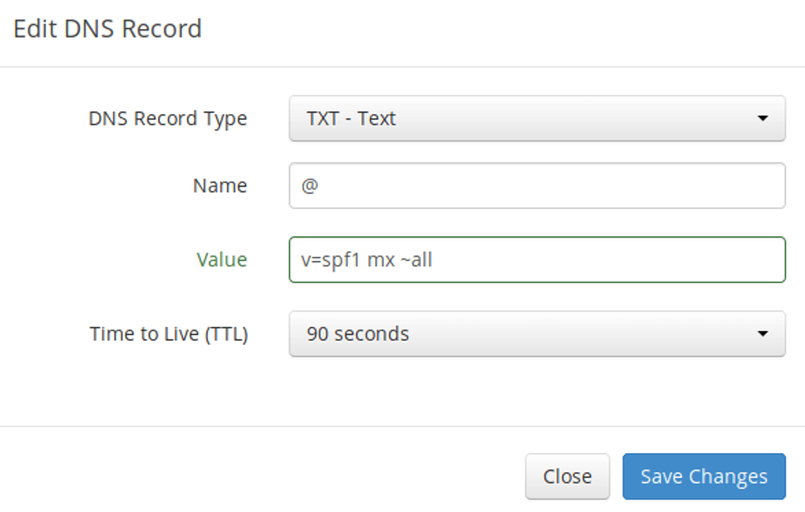

Explanation:

- **TXT** indicates this is a TXT record.
- Enter @ in the name field to represent the main domain name.
- **v=spf1** indicates this is a SPF record and the version is SPF1.
- **mx** means all hosts listed in the MX records are allowed to send emails for your domain and all other hosts are disallowed.
- **~all** indicates that emails from your domain should only come from hosts specified in the SPF record. Emails that are from other hosts will be flagged as forged.  
    
To check if your SPF record is propagated to the public Internet, you can use the dig utility on your Linux machine like below:

```
dig your-domain.com txt
```

The txt option tells dig that we only want to query TXT records.


### DKIM Record

**DKIM** (DomainKeys Identified Mail) uses a private key to digitally sign emails sent from your domain. Receiving SMTP servers verify the signature by using the public key, which is published in the DNS DKIM record.

The iRedMail script automatically configured DKIM for your server. The only thing left to do is creating DKIM record in DNS manager. Run the following command to show the DKIM public key. 

```
sudo amavisd-new showkeys
```
The DKIM public key is in the parentheses.

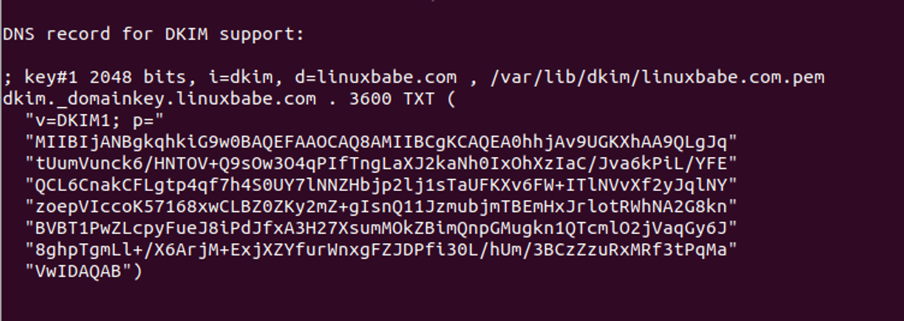

Then in your DNS manager, create a TXT record, enter dkim._domainkey in the name field. Copy everything in the parentheses and paste into the value field. Delete all double quotes and line breaks.

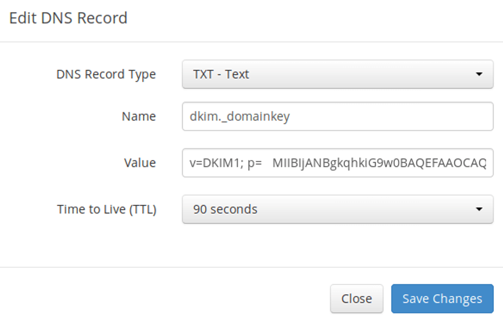

After saving your changes, run the following command to test if your DKIM record is correct.

```
sudo amavisd-new testkeys
```
If the DKIM record is correct, the test will pass.
```
TESTING#1 milad.com: dkim._domainkey.milad.com => pass
```

Note that your DKIM record may need sometime to propagate to the Internet. Depending on the domain registrar you use, your DNS record might be propagated instantly, or it might take up to 24 hours to propagate. You can go to https://www.dmarcanalyzer.com/dkim/dkim-check/, enter dkim as the selector and enter your domain name to check DKIM record propagation.

### DMARC Record

DMARC stands for Domain-based Message Authentication, Reporting and Conformance. DMARC can help receiving email servers to identify legitimate emails and prevent your domain name from being used by email spoofing.

To create a DMARC record, go to your DNS manager and add a **TXT** record. In the name field, enter `_dmarc`. In the value field, enter the following. (You should create the [`[email protected]`](https://www.linuxbabe.com/cdn-cgi/l/email-protection) email address.)

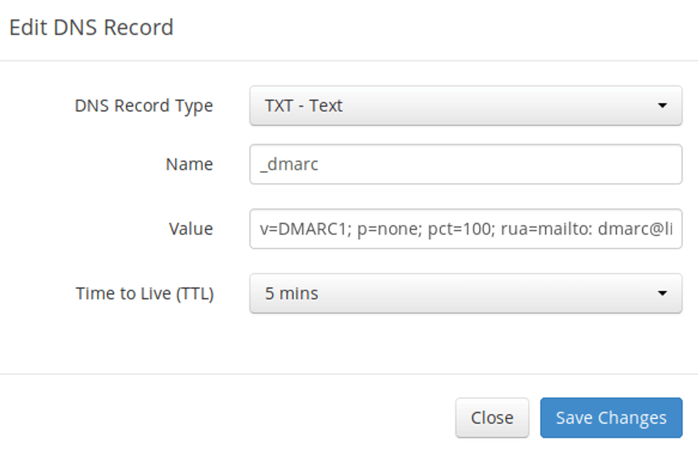

The above DMARC record is a safe starting point. If you want to read the full explanation of DMARC, please check the following article. Note that this is optional.

## Step 10: Testing Email Score and Placement